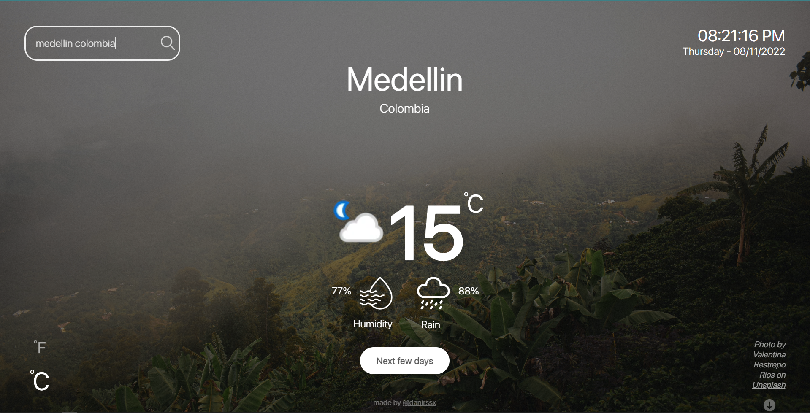

# Weather-App
This is my Weather App. It has an input to search the city that you want and displays a basic information of the weather and a nice background of the City/Country. I have been working on this project for some time now, and it’s finally ready for public release!

It was made in Vanilla Javascript. The design with Adobe XD.   
The API for the weather was: https://www.weatherapi.com/  
The one for the images: https://unsplash.com/developers

# Screenshots 
### Buenos Aires 
  
### Medellin

# Social-Media 
<a href="https://www.instagram.com/danirssx/">Instagram</a>  
<a href="https://www.behance.net/danielross8">Behance</a>  

Thanks!! :heartbeat:	
